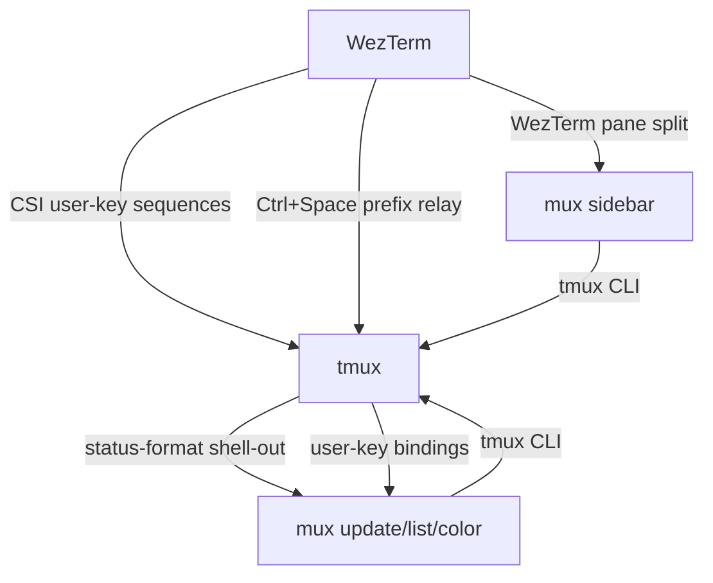

# Architecture: WezTerm → tmux → mux

Three layers, each owning a distinct concern. WezTerm is the GPU-rendered terminal emulator. tmux is the multiplexer (sessions, windows, panes). `mux` is a Rust binary that drives tmux's status bar, session ordering, project management, and an interactive sidebar.

## WezTerm layer

Owns: GPU rendering, font/color config, native macOS integration (fullscreen, notch detection), the sidebar pane lifecycle, and translating Cmd+\* keystrokes into escape sequences tmux can bind.

Does not own: session state, window layout, status bar content.

Keybindings are defined as three data tables in `wezterm.lua`:

- **`prefix_relay`** — Cmd+1..9, Cmd+Shift+F, Cmd+Alt+X → sends `Ctrl+Space` + character (tmux prefix mode).
- **`csi_relay`** — Cmd+N, Cmd+;, Ctrl+Tab, etc. → sends `\e[NN~` CSI sequences mapped to tmux `user-keys[0..9]`.
- **`vim_relay`** — Cmd+S, Cmd+J, Cmd+D, etc. → sends `\e[90;N~` sequences consumed by Neovim's CSI handler.

One special case: **Cmd+P** uses a callback that checks whether the sidebar pane exists. If it does, it focuses the sidebar and sends `/` to activate its filter. If not, it sends CSI `63~` (session chooser).

## tmux layer

Owns: sessions, windows, panes, key bindings (Alt+\* for window/pane ops), status bar rendering (delegates to `mux`), plugin loading via tpm.

Does not own: terminal rendering, project discovery, system resource monitoring.

The tmux config lives at `~/.config/tmux/tmux.conf` (XDG path). It registers ten CSI user-keys (`user-keys[0..9]`) and binds each to a `mux` subcommand. Alt+\* bindings handle window/pane navigation directly in tmux without relaying through WezTerm.

Prefix (`Ctrl+Space`) is reserved for less-common operations: window renaming, session detach, plugin commands.

## mux binary

A single Rust binary at `~/.config/tmux/scripts/mux`, built via `just mux`. It handles status bar rendering, session management, an interactive sidebar, and system resource monitoring.

### Module map

| Module | Purpose |
|---|---|
| `main` | CLI dispatch, `update` (status bar refresh), `switch`, `move`, `select`, `attention`, `rename` |
| `color` | Per-session color assignment from the palette, deterministic hashing |
| `palette` | Catppuccin Mocha color definitions, contrast helpers |
| `filter` | Fuzzy-match helper (nucleo wrapper) used by chooser/sidebar search |
| `order` | Persistent session ordering — load/save `session-order.json`, reorder ops |
| `group` | Session name parsing — `/`-delimited group/suffix splitting, group count aggregation |
| `tmux` | tmux CLI wrapper — `query_state`, `query_windows`, `query_system_info`, `home()` |
| `process` | Child process spawning utilities |
| `logging` | Tracing setup, log rotation, `mux log` subcommand |
| `status` | Status bar segment rendering (`render_bar`, `render_windows`) |
| `usage_bars` | AI usage bar rendering (Claude/Codex/Copilot context + quota windows) |
| `usage/` | Background pollers for Claude/Codex/Copilot usage APIs via `UsagePoller` trait |
| `chooser` | Session chooser popup (fzf-style via `mux chooser`) |
| `picker` | Generic TUI picker/text-input/confirm widgets used by chooser and project flows |
| `project` | Project management — new session, new worktree, favorites, LRU, ditch |
| `sidebar/` | Interactive session sidebar (WezTerm pane) |
| `sidebar/render/` | Sidebar rendering: `frame`, `items`, `hints`, `overlays` |
| `sidebar/meta` | Session metadata display (git branch, path, age) |
| `sidebar/overlay` | Sidebar overlay views (help, session details) |
| `sidebar/claude` | Claude Code session detection and status |
| `sidebar/tree` | Session tree-view rendering |
| `usage/` | System resource providers: `codex`, `copilot` + `mod` (provider trait) |

### State files

All under `~/.config/tmux/`:

| File | Format | Purpose |
|---|---|---|
| `session-order.json` | JSON array of session names | Persisted session display order |
| `session-hidden` | Newline-delimited names | Sessions excluded from the status bar |
| `.session-favorites` | Newline-delimited names | Pinned sessions (sorted to top) |
| `.project-lru` | Newline-delimited paths | Recently-used project directories for the session chooser |

### Logging

Logs go to `~/.local/state/mux/mux.log` (daily rotation, 7-day retention).

- Default level: `WARN`
- Override: `MUX_LOG=debug mux update`
- Read logs: `mux log` (opens in less), `mux log -f` (tail), `mux log --clear`

## Keybinding hierarchy

| Modifier | Layer | Scope | Examples |
|---|---|---|---|
| **Cmd+\*** | WezTerm → tmux (CSI/prefix relay) | Session-level | Cmd+N (new session), Cmd+P (chooser), Cmd+1..9 (window select) |
| **Alt+\*** | tmux (direct) | Window/pane-level | Alt+H/J/K/L (pane navigation), Alt+1..9 (window select) |
| **Ctrl+Space** | tmux prefix | Infrequent ops | prefix+d (detach), prefix+\$ (rename session) |
| **Cmd+\* (vim)** | WezTerm → Neovim (CSI `90;N~`) | Editor commands | Cmd+S (save), Cmd+J (diagnostics), Cmd+D (multicursor) |

## Why this stack

tmux is the session multiplexer because it survives terminal crashes, supports remote attach, and has a mature plugin ecosystem. WezTerm is the terminal because it supports programmatic pane splits (the sidebar), custom CSI relays, and Lua scripting — features needed to bridge macOS Cmd+\* keybindings into tmux's key model.

`mux` exists because tmux's built-in status bar scripting (shell-outs per segment) is too slow for a dense status line and has no state between refreshes. A single Rust binary with cached system info renders the entire bar in one call.

The sidebar is a WezTerm pane (not a tmux pane) because it needs to float outside the tmux pane tree — it's a navigation UI, not a terminal session. WezTerm's `SplitPane` action gives it a stable left-column position that tmux popup windows can't provide.

Alternatives considered: Zellij (no equivalent of tmux's remote attach + plugin ecosystem), WezTerm's native multiplexer (no session persistence across terminal restarts), zmux daemon (prototyped, shelved — the complexity of a persistent daemon didn't pay off vs. the current model of caching in the status-bar binary).
